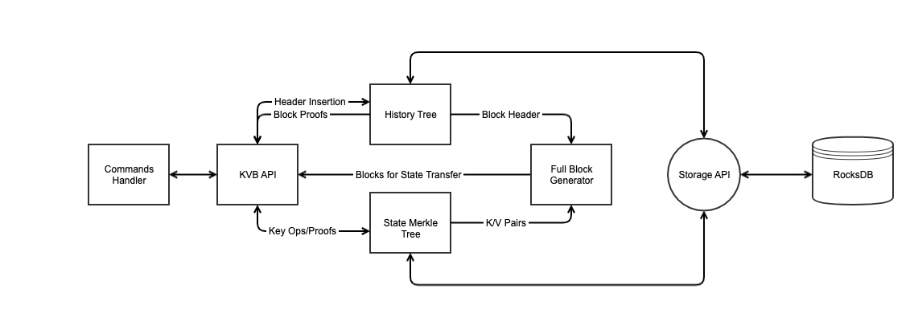

# Functional Requirements

To support the needs of our blockchain, any KVB interface should support the
following operations:

 * Lookup of keys at a given version
 * Insertion of keys at a given version
 * Deletion of keys at a given version
 * Proof of key membership at a given version
 * Proof of key non-membership at a given version
 * Proof of block membership
 * Proof of block non-membership
 * Full Block re-construction so that we can reuse block based state transfer

# Design

For fast key operations, and efficient space usage, we propose using a sparse
merkle tree for state. For block membership proofs, we propose using a secondary
accumulating merkle tree, called a `history tree`. Both trees will be customized
to support deletion.

Each block in the block merkle tree will contain the root hash of it's
corresponding state tree, to allow proofs for any key at any block that has
not been pruned. This is possible by structuring the state tree to maintain old
versions of nodes that have changed, and reuse nodes that have not changed, such
that the state tree is a persistent data structure.

## Logical Architecture and Flow Diagram

A merkle tree based KVB sits at five logical layers, as shown below.

```
--------------------------------
| KVB API                      |
--------------------------------
| Merkle API  | Block Get/Put  |
--------------------------------
| Merkle Tree Implementations  |
--------------------------------
| Storage API                  |
--------------------------------
| Storage Implementation       |
--------------------------------
```

 * The KVB API provides the ability to fulfill our functional requirements
   directly.

 * The KVB API wraps the Merkle tree APIs and the full block access APIs which
   dynamically generate blocks containing keys and values from the History and
   State merkle trees.

 * The merkle tree implementations provide a mechanism for providing a
   generalized multi-version key value store that can also support membership
   and non-membership proofs, and an ability to generate a full history in the
   forms of a blockchain as needed by our current state transfer.

 * The storage API provides generalized interfaces for reading and writing
   key-value pairs that is used by the Merkle tree implementations.

 * The storage implementation is an instantiation of a KV value store that
   supports the storage API. Currently we support RocksDB.



## Components

### State Tree

The `StateTree` is a sparse merkle tree optimized to shorten proofs and searches
by replacing any subtree with 0 or 1 leaf node with a placeholder node
representing a default hash or leaf node, respectively. This structure is
similar to the one used by
[`jellyfish_merkle`](https://github.com/libra/libra/blob/master/storage/jellyfish-merkle/src/lib.rs)
in [Libra](https://github.com/libra/libra).

### Logical Structure

A sparse merkle tree has a leaf for every hash value in a keyspace. So for
instance a 256 bit hash would generate a tree with 2^256 leaves, and 256
levels. Clearly, this tree will not fit in memory. Therefore, we make it sparse
by only recording the in use keys and their paths from the root in storage. We
can do this, because we can calculate the hash values of empty subtrees: An
empty leaf (level 0), has value z0=Hash(0,0). An empty level one node has
z1=Hash(z0, z0), etc...

While this allows us to precompute the empty values for all 256 levels, a
downside of this implementation is that adding a new key always requires
computing 256 hashes. We can however, optimize this requirement, by forcing the
value of any empty subtree to be 0. This leads to on average a hash calculation
of log N, where N is the number of non-empty keys.

The following diagram shows a 4 level sparse merkle tree where subtrees with a
single leaf are replaced by that leaf.

<!-TODO: Show Diagram>
<!-TODO: Describe Proof construction and verification>

### Important Types

#### Tree Deltas

A `TreeDelta` is an analog to the
[TreeCache](https://github.com/libra/libra/blob/master/storage/jellyfish-merkle/src/tree_cache/mod.rs)
in Libra.

When updating a tree, we want to create the paths and mark the stale nodes in
memory first. We then want to write these atomically to persistent storage via a
`db.update_state` call.

The `TreeDelta` structure is the in-memory structure we construct when updating
a node. It consists of a (sub) tree of a sparse merkle tree, and a set of
stale node indexes.

Nodes that are needed to construct a `TreeDelta` are paged in by reading from
persistent storage.

## History Tree

A `HistoryTree` is an accumulating merkle tree, similar to the [one in
Libra](https://github.com/libra/libra/blob/master/storage/accumulator/src/lib.rs),
but specialized to support deletion.

### Logical Structure

<! TODO: Describe how an accumulating tree works>
<! Show diagram(s) of an accumulating tree>


## Interfaces

### History Merkle API

### Block Merkle API

### Storage Interfaces

While we currently use rocksdb, storage should be abstracted out of our merkle
tree construction, so that we may swap implementations later.

#### State Tree

##### Key Structure

For simplicity, each instantiated node in the tree maps to a single RocksDB key.
Since we are building a persistent tree, each node is versioned and thus the
RocksDB key is a concatenation of the key hash and version. We call this
concatenation a `NodeKey`, as shown below. All operations on the database are in
terms of NodeKeys.

```
<--------- NodeKey ----------->
| Key Hash: 256 | Version: 64 |
```

Additionally, since we are building a persistent tree, and wish to support
pruning, there must be a mechanism to keep track of nodes that are no longer
needed as of a given block version. For this, we have a second type of key
called a `StaleNodeIndex`. In order to support efficient pruning, stale node
indexes consist of a concatenation of a `stale-since-version` number and a
`NodeKey`. Therefore, when a prune request for a given block comes in, all nodes
that are safe to prune can be found by iterating in order over the
`StaleNodeIndex`.

```
<--------- StaleNodeIndex ------------->
|Stale Since Version: 64| NodeKey: 320 |
```

We may want to use column families to separate tree state from stale node
indexes, since the latter is only used for pruning, and is not strictly part of
the state.

##### Write Interface
Writes to the underlying storage should be done atomically across two different
sets of key types:

 * `Nodes` - A set of NodeKeys and values to be written
 * `StaleNodeIndexes` - A set of StaleNodeIndex keys

Importantly, both NodeKeys and StaleNodeIndexes, reference root, internal, and
leaf nodes, making deletion identical across all types.

Based on the above, our write interface contains a single method:

```c++
void update_state(Nodes nodes, StaleNodeIndexes stale);
```

##### Read Interface

Our read interface consists of a single method. Since we need to walk a tree for
our purpose, we proceed by reading individual nodes starting at the root. Note
that our underlying storage format may group whole subtrees under a specific
node such that they are read and written together in order to reduce IOPS.

```c++
Node get_node(NodeKey node_key);
```

#### History Tree

##### Block Node structure

A `BlockNode`, as stored by our history merkle tree, has the following structure, where
all numbers are in bits:

```
---------------------------
| ID (Version): 64        |
---------------------------
| Parent Hash: 256        |
---------------------------
| State Hash: 256         |
---------------------------
| Key 1 Size: 15          |
---------------------------
| Key 1 Is Deleted: 1     |
---------------------------
| Key 1: Variable         |
---------------------------
| ...                     |
---------------------------
| Key N Size: 15          |
---------------------------
| Key N Is Deleted: 1     |
---------------------------
| Key N: Variable         |
---------------------------
```

The purpose of the BlockNode is to provide a proof of history for a given
state, as well as contain enough information to generate `Full Blocks` that are
used by our current state transfer mechanism.

##### Interfaces

<!TODO: Describe how the block nodes are read and written>

### FAQ

#### Why a sparse merkle tree instead of a patricia merkle tree ?

A patricia merkle tree can not give a proof of non-inclusion, since we do not
know at what leaf the non-included node is supposed to be at, and therefore
cannot generate a proof via audit path.

A sparse merkle tree is also easier to implement.

#### What are the downsides of sparse merkle trees?

* It's impossible to iterate in actual key order, as all keys are hashed.

#### Why use a persistent tree?

The beauty of a persistent tree is that it allows storing multiple root hashes,
such that a block maps exactly to its corresponding root hash. This allows
direct proof of inclusion for a key from any point in history. Additionally, since all
versions of nodes are stored in individual keys, it means that we don't have to
store "deletion" or "update" flags, or multiple versions of data inside a single
node. This means that a proof is "direct", such that a client can take a given
key-value pair, and block root and get back a proof that does not include
extraneous data.


# TODO
 * `blockchain_db_adapter` should change to use the merkle tree
   * The whole seek mechanism is inefficient and won't work when keys are not
     individual
   * There should be no use of iteration at all since the structure won't
     support it

 * ILocalKeyValueStorageReadOnlyIterator must be removed since the merkle
   structure will not support it
   * This is only used in skvbc and we can do things another way there

